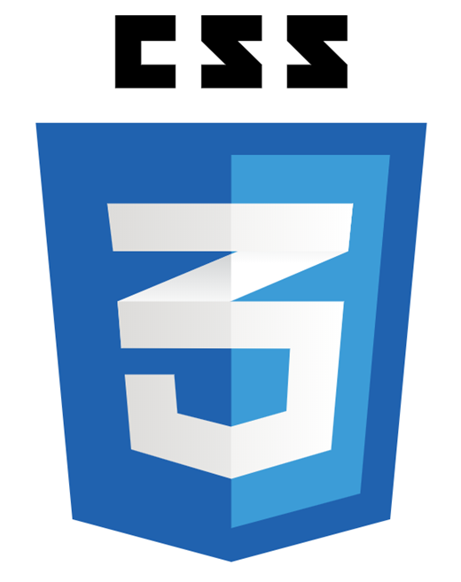

# THEORIE VON CSS, PPEDV EDITION

ppedv AG, Vadzim Naumchyk

<!-- 
IDEEN
http://bennettfeely.com/clippy/ clip-path
http://www.spritecow.com/

PFLEGEN DIESER FOLIEN
Überschriften vereinheitlichen (06.01.2020)
draft-Folien und Abschnitte ausblenden
Folien mit viel Code in Demos übernehmen
in Demos übernommenen Folien mit #demo versehen
Folien auf Englisch übersetzen
Folien mit weniger als 5 Zeilen Text mit anderen Folien vereinen
LABS einbinden und vereinheitlichen
Code-Bilder als Text umschreiben
???, !!! und #todo abarbeiten
Tabellen vereinheitlichen (Folie mit Tabelle im Folienmaster anlegen?)
-->

## CSS > GETTING STARTED

### CSS > GETTING STARTED > IDEA OF CSS

WAS IST CSS

- cascading style sheets
- style language
- Keine Programmiersprache
- Aktuelle Version    <!-- #checkForUpdates -->

WOZU IST CSS

- definiert Stile für Auszeichnungssprachen
- HTML, XML, XHTML, SVG …

### CSS > GETTING STARTED > LINKS

- OFFIZIELLE HOMEPAGE: <https://www.w3.org/Style/CSS/>
- OFFIZIELLE DOCS:
  - <https://www.w3.org/TR/>
  - <https://www.w3.org/TR/CSS/#css>
- ALTERNATIVE DOCS:
  - <https://developer.mozilla.org/en-US/docs/Web/CSS>
  - <https://www.w3schools.com/css/default.asp>
- OFFIZIELLES BLOG: <https://www.w3.org/blog/CSS/>
- ALTERNATIVE BLOGS:
  - <https://www.smashingmagazine.com/category/css>
- OFFIZIELLER CODE: kein open source

<!--
IN COURSE REMARKS:
http://caniuse.com
Caniuse: zeigt Up-to-date Browser-Support-Tabellen für die Unterstützung von Front-End-Web-Technologien auf Desktop- und mobile Web-Browser

https://hacks.mozilla.org/category/css/
Referenzen
Default Values  https://www.w3schools.com/cssref/css_default_values.asp
Browsersupport
https://www.w3schools.com/cssref/css3_browsersupport.asp

BLOGS:
https://hacks.mozilla.org/category/css/
https://www.smashingmagazine.com/category/css

VLOGS:
https://www.youtube.com/channel/UCh5UlGiu9d6LegIeUCW4N1w

-------------------------------------------------------
PREPARATION REMARKS:

??? abarbeiten
https://www.smashingmagazine.com/2019/10/guide-new-experimental-css-devtools-firefox/

 -->

### CSS > GETTING STARTED > TOOLS

OBLIGATORISCH IN DIESEM KURS

- VSCODE & IntelliSense in VSCode z.B.

OPTIONAL

- Firefox CSS DevTools oder DevTools von anderen Browsern
- verschiedene Formatter
- VSCODE ERWEITERUNG HTML CSS Support (ecmel)

<!--
IN COURSE REMARKS:

-------------------------------------------------------
PREPARATION REMARKS:

/* class-Selektor */
        .borderClass {
            /* font-weight: bold; */
            border: 1px solid red;
        }
warum font auch an Kindelementen
border nur am ersten Element ???

??? was macht html css support vscode erweiterung ?
 -->

## CSS > SYNTAX

