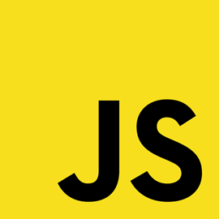

# THEORIE VON CSS, PPEDV EDITION

ppedv AG, Vadzim Naumchyk

<!-- 
INTERN > IDEEN
MS Beispiel DB - Northwind. Versuchen, eine App im Kurs zu entwickeln, die mit dieser DB arbeitet.
Auto-Casting in JS
https://www.youtube.com/watch?v=it0cwNA46lE
ES2019
https://2019.jsconf.eu/tara-z-manicsic/es2019-features-what-even-are-they.html

Die Präsentation in JS Core und JS APIs aufteilen? #todo

INTERN > TODOS für diese Folien
Überschriften vereinheitlichen (05.01.2020)
draft-Folien und Abschnitte ausblenden
Folien mit viel Code in Demos übernehmen
in Demos übernommenen Folien mit #demo versehen
Folien auf Englisch übersetzen
Folien mit weniger als 5 Zeilen Text mit anderen Folien vereinen
LABS einbinden
Code-Bilder als Text umschreiben
???, !!! und #todo abarbeiten
Tabellen vereinheitlichen (Folie mit Tabelle im Folienmaster anlegen?)
-->

## JS > GETTING STARTED

### JS > GETTING STARTED > IDEA OF JS

WAS IST JS

- eine Script-Sprache
- objektorientierte Sprache

WOZU IST JS

- dynamische Manipulation von Webseiten über das DOM
- JS ist für die Logik vom UI oder von der App verantwortlich (HTML für Struktur, CSS für Stile)
- für ereignisgesteuerte Programmiermodelle

<!--
IN-COURSE REMARKS

HTML and CSS are also faster in your browser than JavaScript

Wozu ist noch JS:
Überprüfung von Formulareingaben vor dem Absenden
Senden und Empfangen von Daten, ohne die Seite neu zu laden (AJAX)
sofortiges Vorschlagen von Suchbegriffen
Banner oder Laufschriften
Verschleiern von E-Mail-Adressen

---------------------------------------------------
PREPARATION REMARKS
-->

### JS > GETTING STARTED > LINKS

- OFFICIAL HOMEPAGE ES
  - <https://www.ecma-international.org/memento/tc39.htm>
- OFFICIAL HOMEPAGE JS
  - <https://developer.oracle.com/de/javascript/>
- OFFICIAL STANDARD ES
  - <https://www.ecma-international.org/publications/standards/Ecma-262.htm>
- OFFICIAL BLOG
  - <https://www.ecma-international.org/news/index.html>
- OFFICIAL CODE
  - (ist kein Open Source)
- ALTERNATIVE DOCS
  - <https://developer.mozilla.org/en-US/docs/Web/JavaScript>
  - <https://www.w3schools.com/js/default.asp>
- CONFERENCES
  - <https://jsconf.com/>

<!--
IN-COURSE REMARKS
https://hacks.mozilla.org/category/es6-in-depth/page/2/?utm_source=dev-newsletter&utm_medium=email&utm_campaign=sep26-2019&utm_content=javascript 
https://code.visualstudio.com/docs/nodejs/working-with-javascript
viele (mdn, microsoft docs, google developers, oracle developers, jsconf …)
---------------------------------------------------

PREPARATION REMARKS

https://en.wikipedia.org/wiki/JavaScript
https://en.wikibooks.org/wiki/JavaScript

JS LEARNING LINKS
https://exlskills.com/learn-en/courses/javascript-fundamentals-basics_javascript
https://www.youtube.com/user/codingmath
https://developer.mozilla.org/en-US/docs/Web/JavaScript/JavaScript_technologies_overview
https://developer.mozilla.org/en-US/docs/Web/JavaScript/A_re-introduction_to_JavaScript
 -->

### JS > GETTING STARTED >  TOOLS

PRIMARY

- Texteditor oder IDE, z.B. VSCode
- Browser

SECONDARY (VSCode Plugins)

- ESLint (Intellisense)
- Debugger for Chrome (Install, Debug in Menu, Environment auswählen)
- Prettier (Formatter)
- JavaScript (ES6) code snippets

<!-- 
IN-COURSE REMARKS
Online Editors:
codepen.io
http://jsbin.com/?html,output
https://glitch.com/
---------------------------------------------------
PREPARATION REMARKS
https://code.visualstudio.com/Docs/languages/javascript#_writing-jsconfigjson 

https://marketplace.visualstudio.com/items?itemName=dbaeumer.vscode-eslint#overview
??? was macht ESLint?
https://marketplace.visualstudio.com/items?itemName=msjsdiag.debugger-for-chrome
https://github.com/prettier/prettier
https://prettier.io/
 -->
